**PiTrac 组装指南**

**概述**

本指南将说明如何搭建一个典型的 PiTrac DIY 高尔夫发射监视器（Launch Monitor, LM）。整个过程包括所有物理组件的组装，例如 3D 打印部件、硬件（摄像头、树莓派电脑等）。3D 打印部件的详细打印说明位于各自部件文件的目录中。一些独立子组件（如摄像头支架）的安装说明在单独的文档中，但本文档会提供链接。LM 软件部分的说明是独立的，可以在[这里](https://github.com/jamespilgrim/PiTrac/blob/main/Documentation/Raspberry%20Pi%20Setup%20and%20Configuration.md)找到。

本文档还涉及到摄像头子系统的校准步骤，建议在搭建外壳前详细阅读。在组装 LM 的过程中进行校准是最方便的，因为在 LM 完工前，可以更容易地接触到摄像头和摄像头支架。校准流程可以在[这里](https://github.com/jamespilgrim/PiTrac/blob/main/Documentation/PiTrac%20-%20Camera%20Calibration.zip)找到。

至少在目前，这个 LM 并非一个简单的、只需将 A 部件连接到 B 部件的完整套件。相反，它更像是一个 LM 的通用设计，我们希望制作者能根据自己的目标和技能进行定制、改造和改进。当有人着手搭建时，这里提到的某些零件甚至可能已经无法获取。因此，本文档与其说是一份蓝图，不如说是一份搭建"典型" PiTrac LM 的指南。作者希望制作者的个人创造力和独创性能帮助改进 PiTrac，使其不断发展。

**惯例**

本文档中任何关于左/右/后/前的方位参照，默认都是指当 LM 面向用户时，摄像头一侧朝向制作者的视角。"Pi 侧"指的是右半部分，放置了树莓派、摄像头和连接板。"电源侧"指的是左半部分，容纳了电源适配器和线缆。

3D 部件以房屋结构来命名。构成 LM 外部的弧形部件被称为"墙壁"(walls)。将安装在这些墙壁内部的扁平水平部件被称为"地板"(floors)。一些附加术语如下所示：

**所需工具**

1. M2.5、M3、M4 和 M5 内六角扳手。直角扳手和直柄（螺丝刀式）扳手都会很有用。
2. 尖嘴钳。
3. 中号十字螺丝刀，至少 6 英寸长。
4. 焊接工具。
5. 电线处理工具，如剥线钳、剪线钳，以及制作定制线束所需的任何工具。
   1. 如果定制排线线束，还需要针式连接器套件、压线钳等。
6. 可选：
   1. 带灯放大头戴镜和/或放大台灯。
   2. 如果需要修整部件，Dremel 电动工具会派上用场。
   3. 软/硬橡胶锤或木槌。因为有时候需要一点温柔的"说服"。

**零件和材料**

1. 查看[零件清单文档](https://github.com/jamespilgrim/PiTrac/blob/main/Documentation/PiTrac%20-%20DIY%20LM%20%20Parts%20List.md)获取包括所有螺栓和螺丝在内的完整零件清单。
2. 构成外壳的 3D 打印部件（当然少不了）。
3. 焊料、助焊剂、助焊剂清洁剂。
4. 电线。
   1. 我们在系统的高压部分使用立体声音响线，当需要将 +/- 两根线在大部分走线中保持在一起时，这种线也很有用。
5. 可选：
   1. 砂纸、砂纸块。
   2. 作为对比背景，需要几平方英尺的非红外反射布料，例如大多数黑色毛毡。
      1. 您需要试验哪种布料在红外光下显示为黑色。有些肉眼看起来是黑色的布料在红外光下会呈白色，这对于白色高尔夫球来说会形成一个对比度很差的背景。

**组装说明**

1. 打印外壳组件
   1. 首先，请查看构成 LM 的每个 3D 部件的独立打印和组装说明，[点击这里](https://github.com/jamespilgrim/PiTrac/tree/main/3D%20Printed%20Parts/Enclosure%20Models)。由于某些部件尺寸较大，3D 打印本身就是一个需要数天的项目。
   2. 如果可能，在打印部件***之前***，先将您计划使用的硬件组件拿到手，这样可以根据需要定制部件模型以适应这些组件。例如，如果您的 LED 电源与作者使用的不同，您就需要定制 Pi 侧底层上的安装支架和孔位以适应它。
2. 底层（接触地面的部分！）
   1. 概述
      1. 一些部件，如 LED 电源，将首先放置在两个底层墙体部件的最低部分。然后，将两个底层墙体部件在中间连接起来。接着，将摄像头组件和 Pi 2 安装到 Pi 侧地板上。最后，将 Pi 侧和电源侧的地板用螺丝固定到墙壁内侧的安装支架上。
   2. 墙体半部和下层组件舱（地板正上方的区域）
      1. 在往底层舱放置任何东西之前，趁着还有空间，先将两个 M3 螺母放入 Pi 侧连接垫块的凹槽中。如果很紧，可以用一个临时螺栓从外面将螺母拉入凹槽。用一点透明胶带临时固定螺母会很有帮助。
      2. 在连接两个底部墙体半部之前安装 LED 电源会更容易。该部件通常很重，所以最好把它放在外壳的低处。
      3. 将 LED 电源放置在右半部分，并用四颗 M4 x 12 螺丝将其固定在地板的支架上。该设计适配于[这款电源](https://www.aliexpress.us/item/2251832563139779.html)，但其他电源也应该可行。当然，不同的电源需要不同的 LED 电源支架安装间距。
      4. 电源的输出线应配有快速接头，以便稍后连接到连接板。确保两根线的极性有清晰标记。在快速接头上做极性标记很有帮助。输入端应有一个三脚插头，可以插入 LM 电源侧的电源排插。
      5. 如果您的网络交换机能放得下且不影响线缆连接，现在就将其放入电源侧的舱位。一根网线将从 LM 背面引出，另外两根网线将从交换机连接到 LM 右侧的树莓派。
         1. 现在就将两根 Cat-5/6 网线穿过 Pi 侧舱位可能比在地板安装后再穿要容易。它们之后可以从 LED 电源和底层地板之间穿过（见下文完成的底层图）。
      6. 使用两对 M3 x 16mm 螺栓和螺母连接两个底层半部。
3. 外部（Tee-up）LED 照明
      1. 在底层下方的悬垂部分安装 LED 照明。这种照明有助于高帧率的摄像头 1 在短快门速度下更清晰地看到球。这可以在安装地板之后进行，但会更困难。不过，下面的图片显示的是在地板安装后安装 LED 灯带。因为我们搞砸了顺序。
      2. 如果您使用和我们一样的 LED 灯带，最好使用双层灯带来增加亮度。为此，首先将灯带的一端固定在底层左侧的悬垂部分下方。调整其位置，使末端伸入 LED 灯口几英寸。
      3. 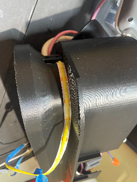
      4. 然后，撕掉背胶，将一层灯带粘贴在悬垂部分的正下方，做一个松散的小弯曲，并将其推入右侧的 LED 灯口约 4 英寸。将下一层灯带粘贴在第一层灯带的正下方，这样在悬垂部分下就有两排 LED 灯。
      5. 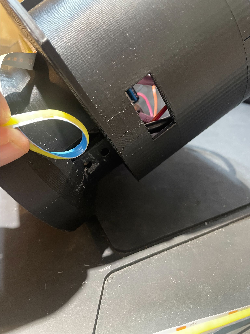
      6. 将带 USB（或其他）电源插头的 LED 灯带末端从最左侧的 LED 灯口穿出。这一端要么插入 PiTrac 内的电源排插，要么（通常更好）从有主电源线和网线的主后口拉出。这样做可以保持树莓派和监视器其余部分的电源开启，但在不主动击球时可以关闭 LED 灯带。它非常亮，而且会变热，所以能关掉是件好事。
      7. 使用底层末端的两个小孔穿过扎带。用扎带（轻轻地）固定灯带的两端。如果您的 LED 灯带粘性很强，可能不需要扎带。
      8. 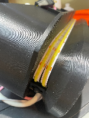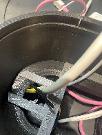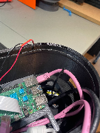
4. 摄像头 2（位于底部，拍摄飞行中高尔夫球的摄像头）
   1. 摄像头改装
      1. 首先，需要对一个[GS 摄像头](https://www.raspberrypi.com/products/raspberry-pi-global-shutter-camera/)进行改装，使其 (1) 使用红外光而非可见光，以及 (2) 允许外部触发其快门。
         1. **警告** - 这些改装将使摄像头的保修失效。它们也非常精细，如果操作不当可能会损坏摄像头。
      2. 移除内部的红外滤光片，该滤光片会阻止红外光进入传感器。请参考[官方说明](https://www.raspberrypi.com/documentation/accessories/camera.html#filter-removal)。
      3. 改装全局快门 GS 摄像头以接受外部触发。请以[树莓派官方说明](https://github.com/raspberrypi/documentation/blob/develop/documentation/asciidoc/accessories/camera/external_trigger.adoc)为指导。移除电阻器是一个特别困难的步骤，您需要使用一个好的放大工作灯和一双稳健的手！
      4. 因为您可能需要多次连接和断开摄像头，所以使用带跳线针端的电线（或其他快速连接装置）可以使过程更轻松。
      5. 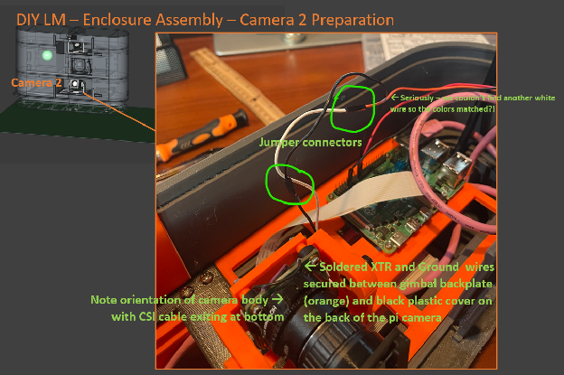
      6. 这是整个 DIY LM 组装过程中最精细的部分，所以请慢慢来。移除多余的电阻器尤其困难，所以可以考虑先在一块您不再使用的旧表面贴装 PCB 上练习。（不是每个人都有这些东西吗？:)）
      7. 将 XTR 和 GND 线焊接到电路板上后，在电线和焊点上滴一小滴浓胶，以起到应力消除的作用。同样为了消除应力，我们将电线从摄像头顶部向下引（见上图），并轻轻地将电线夹在摄像头和摄像头云台组件的背板之间。这样做可以保护电线，让它们从云台底部附近出来，远离可能挂住它们的东西。
   2. 为底部摄像头 2 组装 Pi GS 摄像头及其云台摄像头支架
      1. 注意：底部摄像头支架比顶部摄像头支架短，因为底部摄像头（摄像头 2）不需要向下指向。
      2. 请参考摄像头支架子项目的 README.md 文件中的说明，[点击这里](https://github.com/jamespilgrim/PiTrac/tree/main/3D%20Printed%20Parts/Enclosure%20Models/Pi-Camera-Mounts)。
   3. 将摄像头安装到云台
      1. 在将摄像头用螺栓固定到摄像头组件的背板上***之前***，连接摄像头 CSI 排线会更容易。确保摄像头上的排线锁已锁好，以防排线脱落。
      2. 小心地将 CSI 排线从摄像头支架的背面穿出，确保它不会被背板和云台安装底座夹住。
   4. 添加可见光截止滤光片
      1. 通过使用定位翼将两个部件对齐，将滤光片支架的两个部分粘合在一起进行组装：
      2. 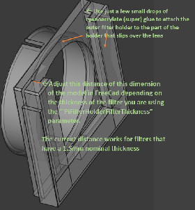
      3. 请参阅[这里的说明](https://github.com/jamespilgrim/PiTrac/tree/main/3D%20Printed%20Parts/Enclosure%20Models/Pi-Camera-Light-Filter-Holder)。
      4. 插入可见光截止滤光片，并将支架安装到镜头上，开口朝上，以防滤光片掉出。
5. Pi 侧底层地板
   1. 注意：两个放置树莓派的地板是相似的。请仔细检查部件上的标签，确保在每一步都使用正确的地板。
   2. 使用一个 M5 螺栓和螺母将摄像头 2 安装在地板 1 上。最好在安装前将 CSI 排线和 GND 及 XTR（外部触发）线全部安装并固定好。
   3. 使用 4 颗 M2.5 x 12 螺栓和螺母将 Pi 4（Pi 5 也可以）安装在地板 1 的右侧，螺母在底部。事先将 Micro-SD 卡（如果使用）插入，因为这时更容易操作。
   4. 将摄像头的扁平 CSI 排线连接到树莓派。
   5. 将摄像头的 GND 连接到树莓派的 Pin 9。
   6. 制作并插入 Pi 2 到连接板的排线
      1. 为此，制作一个三线排线线束，两端都有母头插头。如果可能，使用一根黑色和一根红色线，第三根线用于摄像头 2 的 XTR。请参考下图的下半部分查看完成后的接线：
      2. 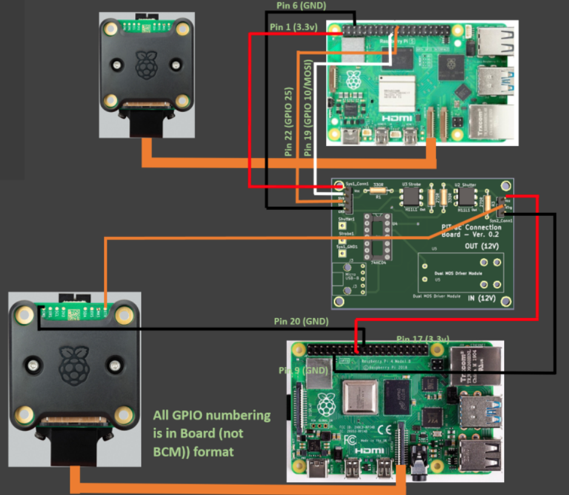
      3. 注意 - 在这部分构建中使用低质量的线束可能会导致之后出现随机、难以诊断的问题。请确保线束能牢固地连接到连接板的引脚上，没有任何松动。将线缆做得比必要的稍长一点也能让事情变得更轻松。
      4. 预压接的排线部件远比自己焊接要容易得多。请参考[这里](https://www.amazon.com/Kidisoii-Dupont-Connector-Pre-Crimped-5P-10CM/dp/B0CCV1HVM9/ref=sr_1_2_sspa?crid=82PRY332YY24&dib=eyJ2IjoiMSJ9.QGbaFF62mgZ1Tf0J7CajkKXRwTNzXfW_5IJDpp-KFNMSPxr3NJETCkY5IC0OIC6NydeuYNxh2IMnpu14CuIxCxLVt4T4kUKlsGMMPk0uwwu7oKUnh2qI2YGvPNmbGfKPCZE6EYSST4_MDqKRP2VMQDk5slq7dKh0rdLvqEMAjboPrVlVx0sd3ShyQsdiUN9ljqd6q-bfi_ZVY2jKoBiwVuMgkZs-BkA3jRBQvkzWpos.aLN0QbPnnKDjbELWeYKRE5SrUWDe-Ivk47o6BkYfL04&dib_tag=se&keywords=ribbon+cable+with+female+connectors&qid=1733175902&sprefix=ribbon+cable+with+femaleconnectors%2Caps%2C143&sr=8-2-spons&sp_csd=d2lkZ2V0TmFtZT1zcF9hdGY&psc=1)查看一个示例套件。
      5. 一个例子（中间连接器比必要的多）是：
      6. 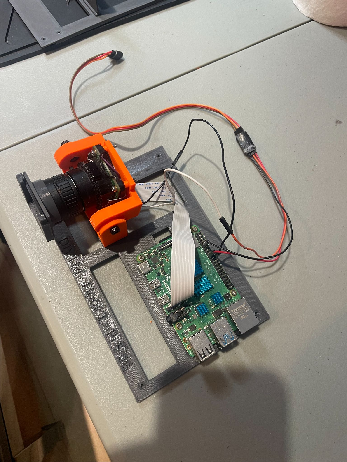
6. 连接两个底层地板半部
   1. 两个底层地板半部在中间通过搭接接头连接。搭接接头有助于将 LM 的两个半部固定在一起。
   2. 确保电源侧地板搭接接头上的任何打印支撑物都已移除，并且接头光滑，能与 Pi 侧地板良好配合。用砂带机小心打磨可能会有帮助。
   3. 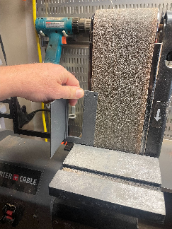
   4. 首先将 6 颗 M3 x 10mm 螺丝拧入电源侧地板的 4 个孔和 Pi 侧地板最右侧（外部）的 2 个孔中几圈。这比稍后放置它们要容易。
   5. 将电源侧地板的搭接接头滑入摄像头底座和 Pi 侧地板的搭接接头之间，使电源侧的最右侧螺丝与 Pi 侧最左侧的两个孔对齐。可能会有点紧。只拧紧重叠孔中的两个螺丝，使两侧（勉强）连接在一起。这个过程比在两个地板都放入底座墙壁后再连接要容易。
   6. 将勉强连接的 Pi 侧地板 1 和电源侧地板放入已连接的底层墙壁中，Pi 在右侧。搭接接头（和两个螺丝孔）应在中间对齐。
   7. 使用 M3 x 10mm 螺丝将地板拧入墙壁侧面的安装垫上。请注意，搭接接头上的两个螺丝穿过两个地板并进入 Pi 侧墙壁的侧垫。
   8. 确保您稍后需要的任何电缆（如网线）没有被夹住或压住。还要确保 LED 电源的电源线在左侧是可触及的。
   9. 连接好的底层组件应如下所示：
   10. 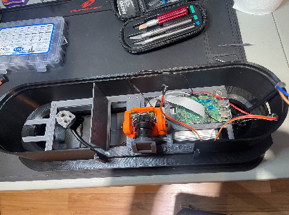
7. 完成底层
   1. 将电源线从将要使用的任何电源排插中穿过最左侧的电源排插支架，然后向下穿出电源侧底座上的孔。这通常很紧，所以先做这一步。
   2. 将一根电源线从树莓派电源连接到 Pi 2 电脑板。可能会和网线一起有点挤。
   3. 将一根网线连接到树莓派。
   4. 完成的底层应类似于：
   5. 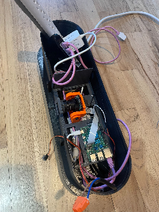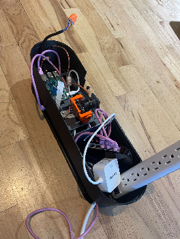
   6.
   7. 为中间层做准备
      1. 在准备将中间层安装到底层上时，轻轻移动将从底层连接到中间（及以上）层组件的电缆：这些电缆包括：
         1. 从网络交换机引出的网线（将连接到中层上层地板的 Pi 1）
         2. 从底层 Pi 2 引出的 3 线线束（将连接到中层下层地板的连接板）
         3. 从底层 LED 电源引出的 LED 闪光灯电源线（将连接到中层下层地板的 LED 闪光灯）
      2. 这些电缆通常都布线到右侧。
   8. 摄像头 2 校准
      1. 现在是校准摄像头 2 的时候了。此时摄像头很容易触及，一旦 LM 的中间层安装在它上面，处理起来会更困难。
      2. 请参阅[这里的校准文档](https://github.com/jamespilgrim/PiTrac/blob/main/Documentation/PiTrac%20-%20Camera%20Calibration.zip)。
3. 中间层组装，包括第二（中）和第三（上）层地板
   1. 概述
      1. 和底层一样，中间层由两个在中间连接的墙体半部组成。但是，在中间层的右侧（Pi 侧）有两层地板。较低的 Pi 侧地板放置了闪光灯 LED 和连接板。较高的地板放置了 Pi 1 电脑和摄像头 1。首先连接墙体半部。然后，将组件安装到 Pi 侧下层地板半部，然后将 Pi 侧和电源侧的下层地板固定到中间层的下部。完成层间布线后，将 Pi 侧上层地板放置在其相应的半部中，位于下层地板之上。
   2. 构建闪光灯组件
      1. 请参阅[这里的闪光灯支架说明](https://github.com/jamespilgrim/PiTrac/tree/main/3D%20Printed%20Parts/Enclosure%20Models/LED-Array-Strobe-Light-Mount)。
   3. 构建连接板
      1. 请参阅连接板说明（独立项目）[这里](https://github.com/jamespilgrim/PiTrac/tree/main/Hardware/Connector%20Board)。
      2. 在将地板安装到墙体半部之前，确保两对 12V IN 和 OUT 线束以及 4 线线束已连接到连接板的螺丝端子。
         1. 尽早将线束连接到***下层***地板上的连接板至关重要，因为一旦安装了***上层*** Pi 侧地板，就很难接触到该板。
         2. 3 线线束应该已经连接到底层的 Pi 2 和 Pi 摄像头 2。
   4. 连接中间层墙体半部
      1. 将四颗 M3 螺母放入 Pi 侧半连接垫的凹槽中。如果很紧，可以用一个临时螺栓从外面将螺母拉入凹槽。胶带可以帮助将螺母固定在凹槽中。
      2. 使用四对 M3 x 16mm 螺栓和螺母连接两个底座半部。
      3. 如有必要，断开两侧并打磨半连接区域，以确保两个半部紧密结合，没有难看的间隙。
   5. 构建中间层下层地板（闪光灯和连接板）组件
      1. 将连接板安装到下层地板上，使 4 针连接头在左侧，字样朝上。用四颗 M3 x 8mm 或 10mm 自攻螺丝安装该板。
      2. 使用一颗 M5 螺栓从地板下方穿过，通过 LED 闪光灯下方底座凹槽中的 M5 螺母，安装闪光灯组件（LED 和云台）。将 LED 电源线布置成从闪光灯组件侧面的线夹穿过。将闪光灯直直地朝向 LM 外部，趁着现在容易操作，拧紧 M5 螺栓。
   6. 将中间层的下层 Pi 侧和电源侧地板安装到中间层墙壁侧面下部安装垫的底部。
      1. 两个下层地板都使用四颗 M3 x 10mm 自攻螺丝安装在下层地板安装垫***下方***的四个螺丝孔上。不要拧得过紧。请注意，地板在垫子下方，但组件在地板的上方。
      2. 中间层（不含 3 线和 4 线线束或电源）与两个下层地板的样子如下：
      3. 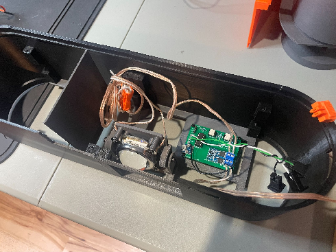
      4. 现在是时候将 5V micro-USB 电源线接到连接板并连接它了。任何 5V 适配器都留在左侧舱位。
   7. 组装摄像头 1 组件
      1. 这个组件与摄像头 2 组件类似，但摄像头 1 会朝下相当陡峭，所以摄像头 1 组件的摄像头安装在一个比另一个摄像头更高的支架上。确保使用正确的摄像头组件，以便摄像头可以向下倾斜。请参阅摄像头支架组装说明，[点击这里](https://github.com/jamespilgrim/PiTrac/tree/main/3D%20Printed%20Parts/Enclosure%20Models/Pi-Camera-Mounts)：见下图：
      2. 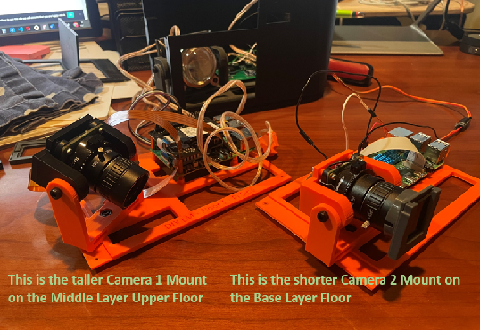
      3. 摄像头 1 使用可见光，因此不需要外部滤光片或改装。
   8. 组装 Pi 侧中间层上层地板
      1. **注意** - 这一步与***底层*** Pi 侧地板的说明非常相似，因为这两个地板都有一个树莓派和一个树莓派摄像头。两个放置树莓派的地板是相似的。请仔细检查部件上的标签，确保在每一步都使用正确的地板。
      2. 使用一个 M5 螺栓和螺母将摄像头 1 组件安装在中间层上层地板上。最好在安装前将 CSI 排线安装并固定好。
         1. **注意：** 摄像头 1 使用与摄像头 2 不同的适配器排线。
         2. 见上图。
      3. 使用 4 颗 M2.5 x 12 螺栓和螺母将 Pi 5 安装在地板 1 的右侧，螺母在底部。事先将 Micro-SD 卡（如果使用）插入，因为这时更容易操作。
         1. 因为我们预计这个 Pi 5 除了作为 PiTrac 的操作部分外，还将用作开发平台，所以建议使用 NVMe 内存而不是 SD 卡。对于长时间的编译，主动散热器也是一个好主意。
      4. 将摄像头的扁平 CSI 排线连接到 Pi 5。请注意，这里需要一根特殊的排线，因为 Pi 5 使用更小尺寸格式的连接器。
   9. 将 Pi 侧中间层上层地板安装到中间层墙壁
      1. 确认两个线束都已连接到连接板后，在将上层地板放置到 Pi 侧中间墙壁的四个安装垫上时，将 4 线线束和第二根网线引导到上层地板的右侧。这将使这些电线能够连接到中间层上层地板上的 Pi 1。
      2. 使用四颗 M3x10mm 自攻螺丝将上层地板安装到侧垫上。
      3. 将来自下层地板连接板左侧的 4 线排线连接到上层地板上 Pi 1 电脑的 GPIO 引脚。请参阅[此处的接线图](images/enclosure_assembly/pcb_wiring_diagram.png)的上半部分。
      4. 将来自底层交换机的第二根网线连接到 Pi。
      5. 将一个与 Pi-5 兼容的电源（我们使用了[这个](https://www.amazon.com/CanaKit-PiSwitch-Raspberry-Power-Switch/dp/B07H125ZRL/ref=sr_1_4?crid=VQOV0R8XMNA0&dib=eyJ2IjoiMSJ9.AIdxZFc5tMLjKfCV9BEe403XELKsVK5ndYzxw68q3PbGDjPo9KQm1JsQqA1h6nNjDr0lR4B1gYTxx-xvP7ZNO3E-kw8olMpPmL3hOKJjZhHnerTOlTQBX3TPetkPZKHA4ANA88ZTNG_YMrLZKe9axLtBJSPC7yRtBsvcTH4q1eVb0Z5MGtRBbrFwjlwdPpKkCfFPXzmvqDFG4EceescwS9N5JDTKTBLBxfHe16GA5Kw.Z_0SKpqLaqnW-tz8_Xk9G0eAQ5kLujm9s-PL9_7gYvg&dib_tag=se&keywords=pi+5+power+supply&qid=1733787377&sprefix=pi+5+power+supply%2Caps%2C138&sr=8-4)）从电源侧连接到 Pi 5。尽量让电缆远离下层地板上的闪光灯和其他硬件。
      6. 此时 Pi 5 应该可以运行了，摄像头也准备好进行校准。
   10. 中间层电源侧组件在中间墙壁上的安装
       1. 中间层电源侧没有上层地板。下层地板的隔墙足够高，可以隔开整个中间层的电源侧。
   11. 将中间层安装到底层上（现在真的快成型了！）
       1. 在连接中间层和底层之前，确保您已经准备好从底层引出的线缆（特别是 3 线线束），这些线缆将连接到中间层的连接板。
       2. 用一只手牢牢抓住中间层的后壁，将其举到底层上方，这样另一只手就可以移动东西。
       3. 将网线、LED 电源输出线和连接板线束从底层的右侧推开，并在将中间层放置到底层位置时，将它们穿过中间层右侧的空间。这些电缆需要连接到中间层上层地板的组件。
          1. 在左侧：将您使用的任何电源排插和电源适配器从中间层左侧的空隙中引导上去。
          2. 在右侧：将从下层引出的电缆穿过中间层最右侧的空间，就在下层地板的右边。请看下面当我们开始将两层放在一起时应该是什么样子：
       4. 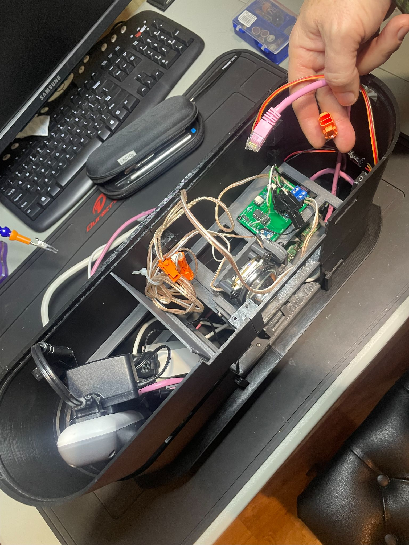
       5. ***在***尝试完全连接（卡合）两层之前，请确保所有各种电线都已完全进入墙壁内部，并且在两层合拢时不会被夹住或切断！
       6. 轻轻地将中间层底部的内墙卡扣插入底层顶部的墙壁卡扣内。通常更容易将上层放入下层的后部，然后向外拉动底层的前部，以帮助上层卡扣卡入底层。
       7. 克制住想把最上层往下敲入底层的冲动。注意 - 中间层的顶部相当锋利！
   12. 将底层 LED 电源的输出连接到连接板双 MOS 开关上标有"IN (12V)"的螺丝端子。
       1. **警告** - 检查并再次检查线的极性是否正确。使用有清晰标记的线（例如线对中一根线有白条）会有帮助。如果 LED 接反了，可能会被烧毁。
       2. 使用只能以一种方式连接（不能翻转）的"带键"线连接器是一个可靠的做法。
       3. 大多数可与连接板一起使用的 MOS 开关板上都会有极性标记。例如，见下图：
       4. 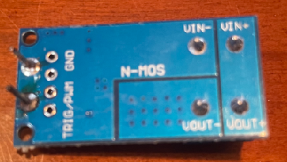
       5. 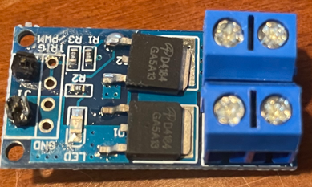
       6. 但请注意，您采购的组件可能会有所不同！
   13. 将连接板"OUT (12V)"端子的引线连接到 LED 闪光灯。
       1. 确保您没有意外地将闪光灯直接连接到 LED 电源的***输出***端。这样做可能会熔化闪光灯组件或更糟。
       2. 与上述极性警告相同。
   14. 将来自底层地板的 Pi 2 和 Pi 摄像头 2 的线束连接到连接板。
       1. 使用下一小节中的示意图布局，确保来自底层的摄像头 2 和 Pi 2 的正确电线连接到连接板上正确的头针引脚。
4. 固定底层和中间层
   1. 使用 M3 x 6mm 自攻螺丝在中间层底部和底层顶部交界处的四个螺丝孔中固定各层。为安全起见，将层间螺丝的尖端（目前悬在层内部）打磨钝是个好主意。
5. 摄像头 1 校准
   1. 在将天花板盖在上面的摄像头 1 上之前，使用[这里的独立摄像头校准文档](https://github.com/jamespilgrim/PiTrac/blob/main/Documentation/PiTrac%20-%20Camera%20Calibration.zip)校准该摄像头。
6. 顶部墙壁（天花板）部分组装
   1. 使用四颗 M3 螺栓和螺丝连接两个天花板半部。
   2. 将天花板部分卡在中间层的顶部。在天花板层底部和中间层顶部交界处的四个螺丝孔中使用 4 颗 M3 x 6mm 自攻螺丝固定。为安全起见，将层间螺丝的尖端（目前悬在层内部）打磨钝是个好主意。
7. 添加前窗
   1. 通过将 15.5cm x 24cm 的有机玻璃防球撞击保护窗滑入天花板层和底层中的安装槽中来添加它。有机玻璃窗应离摄像头和闪光灯足够远，以免球撞击窗户时击中那些昂贵的组件。
8. PiTrac 徽章/标志
   1. PiTrac 徽章是通过分别打印徽章的背板和字母（以及"PiTrac"字母的部分）然后将它们组合在一起制成的。
   2. 当然，您可以选择您喜欢的颜色。我们使用以下调色板：
   3. 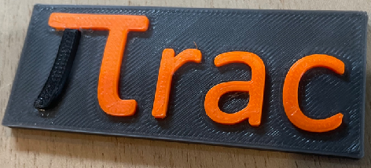
   4. 如果背板打印为全尺寸，而字符打印为 99% 的尺寸，则部件会更好地配合。打印出上图所示的部件后，用硬橡胶锤可以轻松地将字符敲入位。摩擦力足以将部件固定在一起，但在接缝处滴入一点氰基丙烯酸酯胶水（瞬干胶）将永久固定它们。
   5. 我们使用双面胶带来粘贴徽章，因为粗糙的表面粘合效果不佳。
9. 下一步是阅读[这里的启动文档](https://github.com/jamespilgrim/PiTrac/blob/main/Documentation/PiTrac%20Start-Up%20Documentation.md)。 